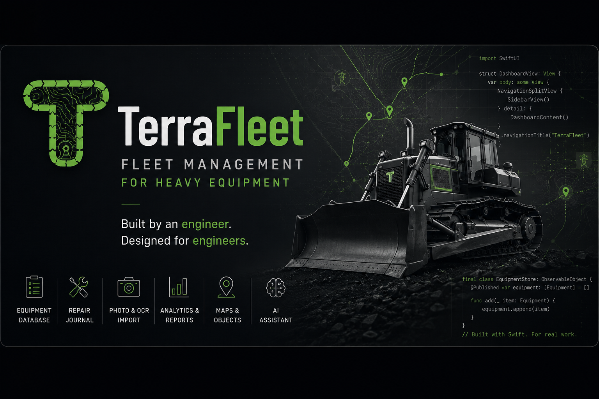

  

<h1 align="center">Hi, I'm Vladislav 👋</h1>

Engineer • Building <strong>TerraFleet</strong> • Learning Swift every day

<i>Built by an engineer. Designed for engineers.</i>

---

# 🚜 TerraFleet

**TerraFleet** is a native macOS application for managing heavy and construction equipment.

It combines equipment records, maintenance, repairs, operators, documents, maps, photos and analytics into one clean workspace.

> **Everything about your equipment. In one place.**

---

# ✨ Current Features

- Equipment database
- Repair journal
- Operators
- Documents
- Photo storage
- OCR import
- Fleet analytics
- Offline-first architecture

---

# 🛠 Tech Stack

- Swift
- SwiftUI
- Xcode
- macOS
- JSON
- Vision OCR

---

# 🚧 Current Status

TerraFleet is under active development.

Current focus:

- Better Equipment Management
- Repair Workflow
- Offline Maps
- OCR Improvements
- Analytics
- AI Assistant

---

# 📚 Learning

While building TerraFleet I'm learning:

- Swift
- SwiftUI
- macOS Development
- Software Architecture
- Product Design

---

# 🎯 Vision

Build software that engineers enjoy using every day.

---

# 📍 Philosophy

> Great engineering deserves great software.
